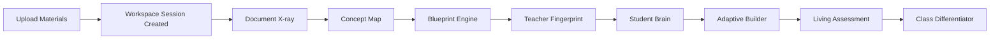
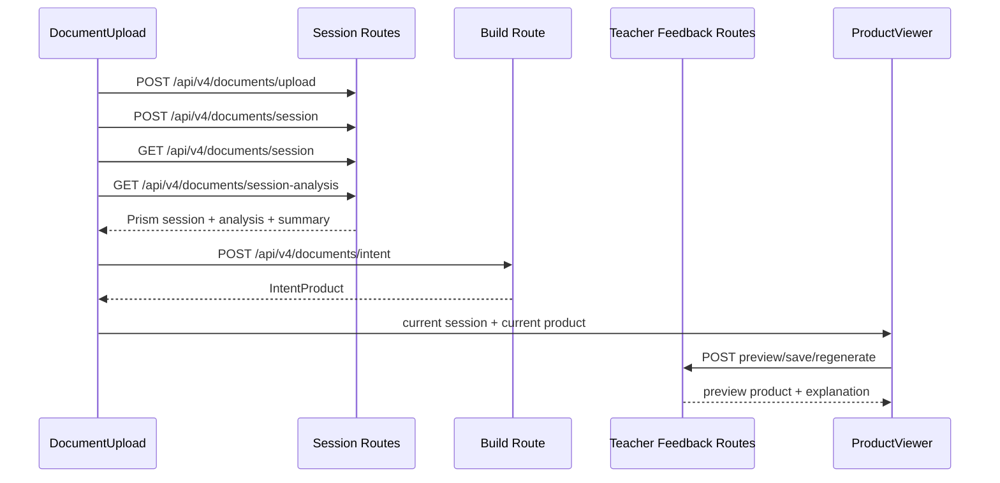

# Ocean on Mars Integration Architecture

This document is the execution harness for the pavilion build plan.

The build plan defines what to reveal and in what order. This document defines how the surfaces share state, where they live in the repo, which routes own each transition, and how to ship the experience without creating parallel systems.

Companion plan: [OCEAN_ON_MARS_BUILD_PLAN.md](OCEAN_ON_MARS_BUILD_PLAN.md)

Companion technical breakdown: [EPIC_4_5_OCEAN_ON_MARS_TECHNICAL_BREAKDOWN.md](EPIC_4_5_OCEAN_ON_MARS_TECHNICAL_BREAKDOWN.md)

## Core Principle

Every surface should read from and write to a single session object:

## The Instructional Intelligence Session

This is not a replacement for the existing PRISM V4 session context. It is the teacher-facing orchestration layer built on top of it.

Existing base context already exists in [src/prism-v4/documents/registryStore.ts](src/prism-v4/documents/registryStore.ts) as `PrismSessionContext`:

- `session`
- `registeredDocuments`
- `analyzedDocuments`
- `collectionAnalysis`
- `sourceFileNames`
- `groupedUnits`

The new session spine should extend that substrate rather than fork it.

## Session Schema

```ts
type SurfaceId =
  | "document-xray"
  | "concept-map"
  | "blueprint-engine"
  | "teacher-fingerprint"
  | "student-brain"
  | "adaptive-builder"
  | "living-assessment"
  | "class-differentiator";

interface InstructionalIntelligenceSession {
  sessionId: string;
  createdAt: string;
  updatedAt: string;
  currentAct: 1 | 2 | 3;
  activeSurface: SurfaceId;

  prism: PrismSessionContext;

  analysis: {
    raw: DocumentCollectionAnalysis;
    summary: {
      concepts: string[];
      problems: Array<{
        documentId: string;
        sourceFileName: string;
        problemCount: number;
      }>;
      misconceptions: string[];
      bloomSummary: Partial<Record<"remember" | "understand" | "apply" | "analyze" | "evaluate" | "create", number>>;
      modeSummary: Record<string, number>;
      scenarioSummary: Record<string, number>;
      difficultySummary: {
        low: number;
        medium: number;
        high: number;
      };
      domain?: string;
    };
  };

  planning: {
    selectedDocumentIds: string[];
    primaryDocumentId: string | null;
    selectedIntent: IntentType;
    focus: string;
    itemCount: number | null;
    unitId: string | null;
    teacherId: string | null;
    studentId: string | null;
    adaptiveConditioningEnabled: boolean;
    conceptBlueprint: ConceptBlueprint | null;
  };

  teacherModel: {
    fingerprintLoaded: boolean;
    fingerprintShapingActive: boolean;
    teacherId: string | null;
    unitId: string | null;
    preferences: {
      itemModes: string[];
      scenarioTypes: string[];
      bloomBias: Record<string, number>;
      difficultyBias: Record<string, number>;
    };
    reasons: string[];
  };

  learnerModel: {
    studentId: string | null;
    profile: StudentPerformanceProfile | null;
    adaptiveTargets: Record<string, unknown> | null;
    reasons: string[];
  };

  outputs: {
    currentProduct: IntentProduct | null;
    recentProducts: IntentProduct[];
    previewProduct: IntentProduct | null;
    builderPlanNarrative: string | null;
  };

  differentiation: {
    enabled: boolean;
    groups: Array<{
      id: string;
      label: string;
      studentIds: string[];
      dominantNeeds: string[];
      generatedProductId?: string;
    }>;
  };
}
```

## Design Rule

The `InstructionalIntelligenceSession` is a composition object, not a persistence mandate.

- Persist the existing underlying primitives where they already live.
- Compose the teacher-facing session object in the UI first.
- Introduce a dedicated aggregator route only when the browser composition becomes repetitive or expensive.

That keeps Act 1 shippable without a server rewrite.

## What Exists Already

The repo already contains the main pieces needed for this session spine:

- Workspace state and build controls live in [src/components_new/v4/DocumentUpload.tsx](src/components_new/v4/DocumentUpload.tsx).
- Assessment blueprint editing already exists inside [src/components_new/v4/ProductViewer.tsx](src/components_new/v4/ProductViewer.tsx).
- The core build path lives in [src/prism-v4/documents/intents/buildIntentProduct.ts](src/prism-v4/documents/intents/buildIntentProduct.ts).
- Session analysis is exposed by [api/v4/documents/session-analysis.ts](api/v4/documents/session-analysis.ts).
- Session context composition lives in [src/prism-v4/documents/registryStore.ts](src/prism-v4/documents/registryStore.ts).
- Assessment blueprint persistence and explanation retrieval live in [api/v4/teacher-feedback/assessment-blueprint.ts](api/v4/teacher-feedback/assessment-blueprint.ts).
- Preview and constrained regeneration live under [api/v4/teacher-feedback](api/v4/teacher-feedback).
- Student performance schema already exists in [src/prism-v4/studentPerformance/StudentPerformanceProfile.ts](src/prism-v4/studentPerformance/StudentPerformanceProfile.ts).
- Item-level explanation fields already exist in [src/prism-v4/schema/integration/IntentProduct.ts](src/prism-v4/schema/integration/IntentProduct.ts).
- A concept-graph foothold already exists in [src/components_new/v4/ConceptGraph.tsx](src/components_new/v4/ConceptGraph.tsx).

## State Ownership

The main execution mistake to avoid is scattering pavilion state across unrelated React components.

Use this ownership split.

### 1. Session shell

Owner: [src/components_new/v4/DocumentUpload.tsx](src/components_new/v4/DocumentUpload.tsx)

Responsibilities:

- upload and workspace creation
- session refresh
- selected documents
- primary document
- intent selection
- focus and item-count controls
- teacher, unit, and student selection inputs
- current product selection
- recent build history

This component should become the first host of `InstructionalIntelligenceSession`.

### 2. Analysis surface

Owner: new `AnalysisPanel` under `src/components_new/v4/`

Responsibilities:

- render normalized analysis summary
- show concepts, misconceptions, Bloom, mode, scenario, difficulty, and domain
- host the Act 1 reveal state

Data source:

- `workspace.analysis`
- `workspace.analyzedDocuments`

### 3. Planning surface

Owner: [src/components_new/v4/ProductViewer.tsx](src/components_new/v4/ProductViewer.tsx)

Responsibilities:

- select the correct product-specific UI
- host blueprint editing for assessment products
- host future teacher fingerprint, student profile, and plan views for assessment builds

### 4. Assessment blueprint surface

Owner: existing `AssessmentConceptVerificationPanel` inside [src/components_new/v4/ProductViewer.tsx](src/components_new/v4/ProductViewer.tsx)

Responsibilities:

- section order
- include or exclude concepts
- per-concept item counts
- Bloom ceilings and distributions
- scenario preferences
- concept additions and merges
- preview, save, and constrained regeneration

This is already the seed of the Blueprint Engine. It should be elevated, not replaced.

### 5. Teacher model surface

Owner: new `TeacherFingerprintPanel` rendered by `ProductViewer` for `build-test`

Responsibilities:

- show inferred teacher preferences
- show whether current build is fingerprint-shaped
- expose opt-in and override controls
- emit explanation text into the shared session object

### 6. Learner model surface

Owner: new `StudentProfilePanel` rendered by `ProductViewer` for `build-test`

Responsibilities:

- load and render concept, Bloom, mode, and scenario mastery
- render misconception clusters and timing patterns
- show what adaptive conditioning is doing to the current plan

### 7. Artifact and explanation surface

Owner: `ProductViewer` assessment renderer plus a new `BuilderPlanView`

Responsibilities:

- show item metadata already carried in `TestItem.explanation`
- show section-level and whole-build rationale
- show teacher reasons and student reasons together

## Route Architecture

The right architecture here is additive, not replacement-based.

### Existing routes to keep as the spine

- [api/v4/documents/upload.ts](api/v4/documents/upload.ts): creates the document workspace and performs inline analysis.
- [api/v4/documents/session.ts](api/v4/documents/session.ts): returns session documents and analyzed documents.
- [api/v4/documents/session-analysis.ts](api/v4/documents/session-analysis.ts): returns collection analysis.
- [api/v4/documents/intent.ts](api/v4/documents/intent.ts): builds intent products and returns persisted products.
- [api/v4/teacher-feedback/concept-verification-preview.ts](api/v4/teacher-feedback/concept-verification-preview.ts): preview assessment blueprint changes without persistence.
- [api/v4/teacher-feedback/assessment-blueprint.ts](api/v4/teacher-feedback/assessment-blueprint.ts): load and persist blueprint edits.
- [api/v4/teacher-feedback/regenerate-item.ts](api/v4/teacher-feedback/regenerate-item.ts): constrained item replacement.
- [api/v4/teacher-feedback/regenerate-section.ts](api/v4/teacher-feedback/regenerate-section.ts): constrained section replacement.

### Minimal route additions by act

#### Act 1

Do not add a new orchestration route yet.

Instead:

- normalize teacher-facing analysis summaries near [api/v4/documents/session-analysis.ts](api/v4/documents/session-analysis.ts)
- keep returning raw `collectionAnalysis` for downstream use
- let `DocumentUpload` compose the first `InstructionalIntelligenceSession` in memory

#### Act 2

Add one optional aggregator route only if needed:

- `GET /api/v4/documents/intelligence-session?sessionId=...`

Responsibilities:

- hydrate `PrismSessionContext`
- attach normalized analysis summary
- attach persisted teacher fingerprint context for the active teacher and unit
- attach persisted blueprint state for the active assessment when a product is selected

This route should be a read model, not a second source of truth.

#### Act 3

Add learner-aware read helpers if browser composition becomes too chatty:

- `GET /api/v4/student-performance/profile?studentId=...&unitId=...`
- optional grouped differentiation orchestration route when class-level variant generation lands

## Component Tree

Target UI structure:

```text
DocumentUpload
|- WorkspaceHeader
|- WorkspaceDocumentList
|- BuildConfigurator
|- AnalysisPanel
|- ProductViewer
|  |- ProductHeader
|  |- AssessmentWorkspaceTabs
|  |  |- BlueprintEnginePanel
|  |  |  |- AssessmentConceptVerificationPanel
|  |  |  |- ConceptMapPanel
|  |  |- TeacherFingerprintPanel
|  |  |- StudentProfilePanel
|  |  |- BuilderPlanView
|  |  |- LivingAssessmentPreview
|  |- NonAssessmentProductViews
|- RecentBuildsPanel
```

Implementation note:

- `AssessmentConceptVerificationPanel` should be extracted into its own file once Act 2 work begins.
- `ConceptGraph.tsx` should be reused as the first implementation base for the Concept Map rather than starting from zero.

## Surface Handoffs

Each pavilion surface should hand data forward in a single direction.

### Surface 1 to Surface 2

`AnalysisPanel` emits:

- normalized concepts
- problem counts
- misconception themes
- concept relationships or co-occurrence signals

These become the seed inputs for `ConceptMapPanel`.

### Surface 2 to Surface 3

`ConceptMapPanel` emits:

- included concepts
- concept order
- merges
- renames

These become `planning.conceptBlueprint.edits`.

### Surface 3 to Surface 4

`BlueprintEnginePanel` emits:

- concept quotas
- Bloom distributions
- scenario preferences
- section ordering

These are previewed through the existing teacher-feedback routes and become the visible planning artifact.

### Surface 4 to Surface 5

`TeacherFingerprintPanel` contributes:

- inferred preferences
- active constraints
- explanation text

These shape the same concept blueprint and build path rather than a separate teacher-model API.

### Surface 5 to Surface 6 and 7

`StudentProfilePanel` contributes:

- adaptive targets
- weak concepts
- Bloom weaknesses
- mode weaknesses
- misconception targets

These should flow through existing adaptive conditioning inputs already accepted by the build path.

### Surface 7 to Surface 8

`LivingAssessmentPreview` emits:

- per-item explanation metadata
- per-section rationale
- plan and artifact consistency

These become the basis for grouped differentiation explanations.

## EPIC-Ready Implementation Breakdown

This is the repo-level execution order that preserves the pavilion sequence and avoids rework.

### Track A: Session composition

1. Introduce an `InstructionalIntelligenceSession` view-model type under `src/components_new/v4/` or `src/prism-v4/schema/`.
2. Compose it inside `DocumentUpload` from existing workspace, selection, and product state.
3. Add selector helpers so `AnalysisPanel`, `ProductViewer`, and future assessment panels read one object instead of ad hoc props.

### Track B: Act 1 X-ray

1. Normalize analysis summary fields at [api/v4/documents/session-analysis.ts](api/v4/documents/session-analysis.ts).
2. Create `AnalysisPanel` in `src/components_new/v4/`.
3. Mount it in the workspace grid beside the existing material and build controls.
4. Add tests covering upload, refresh, and visible summary rendering.

### Track C: Act 2 planning mind

1. Extract `AssessmentConceptVerificationPanel` into its own component file.
2. Add tabbed assessment workspace UI inside `ProductViewer`.
3. Promote blueprint editing as the first assessment tab.
4. Build `ConceptMapPanel` using the existing concept graph substrate plus blueprint edits.
5. Add `TeacherFingerprintPanel` using teacher-feedback routes and existing fingerprint explanation logic.

### Track D: Act 3 learner adaptation

1. Add `StudentProfilePanel` using the existing student performance profile schema.
2. Add `BuilderPlanView` to expose concept quotas, Bloom ladder, difficulty ramp, and adaptive targets.
3. Expand the assessment preview to foreground `TestItem.explanation`.
4. Add grouped differentiation orchestration only after the single-student loop is coherent.

## Normalization Contracts

The browser should not have to derive the Act 1 reveal from raw arrays every time.

Normalize at the route boundary for these view-model fields:

```ts
interface AnalysisSummaryViewModel {
  concepts: string[];
  problems: Array<{
    documentId: string;
    sourceFileName: string;
    count: number;
  }>;
  misconceptions: string[];
  bloomSummary: Record<string, number>;
  modeSummary: Record<string, number>;
  scenarioSummary: Record<string, number>;
  difficultySummary: {
    low: number;
    medium: number;
    high: number;
  };
  domain?: string;
}
```

Return shape for Act 1 should become:

```ts
{
  session,
  analysis,
  summary
}
```

Where:

- `analysis` remains the raw `DocumentCollectionAnalysis`
- `summary` is the teacher-facing read model

## UI Sequencing Diagram



## Request Flow Diagram



## Demo Script

This is the executive demo sequence the product should eventually support.

1. Upload a unit packet and land directly in a workspace that already shows concepts, misconceptions, Bloom, difficulty, and domain.
2. Open the Concept Map and drag the unit into a cleaner conceptual order.
3. Open the Blueprint tab and show the concept quotas, Bloom ladder, and scenario mix becoming editable teacher controls.
4. Reveal the Teacher Fingerprint panel and show that the current build is shaped by that teacher's preferences.
5. Select a student and open Student Brain to show mastery, misconceptions, and response-time patterns.
6. Open Builder Plan View and show how teacher intent and student need are fused into one plan.
7. Open Living Assessment and inspect an item that explains its own concept choice, Bloom level, scenario, mode, and student rationale.
8. Switch to Class Differentiator and show grouped variants with explanations for why each version exists.

## Shipping Rule

Ship the pavilion as a single unfolding session, not a collection of clever panels.

If a surface cannot answer these three questions, it is not ready:

1. What state did it inherit from the previous surface?
2. What decision can the teacher make here?
3. What state does it pass forward to the next surface?

That is the difference between a feature stack and a World's Fair moment.