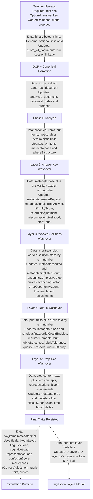

# Washover Pipeline

This document is the authoritative architecture reference for the test-document washover pipeline.

It captures the current repository behavior across upload, OCR, Phase B analysis, the four washover layers, final trait persistence, simulation consumption, and modal display.

## Scope

The pipeline covered here is:

1. Teacher uploads the test document.
2. Teacher may also upload any combination of answer key, worked solutions, rubric, and prep doc.
3. The system performs OCR and canonical extraction.
4. The system runs Phase B deterministic item analysis.
5. The system applies four sequential washover layers.
6. The resulting final traits are used by simulation and surfaced in the ingestion layers modal.

## System Diagram

## Upload To Washover Trace

### Upload Surfaces

The main upload surfaces are:

- `src/components_new/v4/DocumentUpload.tsx`
- `src/components_new/v4/ShortCircuitPage.tsx`

The session and resource-link orchestration lives in:

- `src/hooks/useInstructionalSession.ts`
- `src/prism-v4/documents/registryStore.ts`
- `api/v4/documents/session.js`

### Shared Upload And OCR Path

All uploaded documents follow the same ingestion boundary:

1. Binary upload is posted to `/api/v4/documents/upload`.
2. The upload route registers the document and analyzes it.
3. For PDFs, Azure Document Intelligence is called.
4. The result is normalized into `azure_extract` and canonicalized into `canonical_document`.
5. Phase B item analysis persists item rows with deterministic base traits.

Core implementation locations:

- `api/v4/documents/upload.js`
- `src/prism-v4/documents/analysis/analyzeRegisteredDocument.ts`
- `src/prism-v4/ingestion/azure/azureExtractor.ts`
- `lib/azure.ts`

### Resource Link Persistence

Companion documents are bound to the primary test document using `v4_document_resource_links`.

Each link records:

- `session_id`
- `document_id`
- `resource_document_id`
- `resource_type`
- `content_text`

`content_text` is derived from:

- canonical document nodes when available
- `azure_extract.content`
- Azure paragraphs
- Azure pages
- flattened Azure tables

This is especially important for prep-doc ingestion, where empty `content_text` is treated as a failure.

## Companion Document Pipelines

### Answer Key

Flow:

`Upload -> OCR/canonical extraction -> resource_links(answer-key) -> session hydration -> Layer 2 washover`

Handled in:

- Upload UI: `src/components_new/v4/DocumentUpload.tsx`, `src/components_new/v4/ShortCircuitPage.tsx`
- Session link creation: `src/hooks/useInstructionalSession.ts`
- Link persistence: `src/prism-v4/documents/registryStore.ts`
- Washover consumption: `api/v4/documents/session.js`

### Worked Solutions

Flow:

`Upload -> OCR/canonical extraction -> resource_links(worked-solution) -> session hydration -> Layer 3 washover`

Handled in the same path as answer key, with `resource_type = worked-solution`.

### Rubric

Flow:

`Upload -> OCR/canonical extraction -> resource_links(rubric) -> session hydration -> Layer 4 washover`

Handled in the same path as answer key, with `resource_type = rubric`.

### Prep Doc

Flow:

`Upload -> OCR/canonical extraction -> resource_links(prep-doc) -> session hydration -> Layer 5 washover`

Prep docs differ in one key respect: `content_text` is enforced and missing prep-doc text fails ingestion.

## Per-Layer Contract

| Layer | Inputs | Transformations | Outputs | Parent Coverage | Sub-item Coverage | Aggregate Coverage |
|---|---|---|---|---|---|---|
| Answer Key (Layer 2) | `metadata.base`, parsed answer-key text keyed by logical sub-item label first (`3a`) with group/parent fallback (`3`) | correctness alignment, format and ambiguity difficulty impact, `pCorrectAdjustment`, misconception shift | `metadata.answerKey`, `metadata.final.correctAnswer`, `difficultyScore`, `pCorrectAdjustment`, `misconceptionLikelihood`, `stepCount` | Yes. Parent rows are recomputed as aggregates when multipart child rows exist. | Yes. Sub-items now resolve by logical label before falling back to the group key. | Yes, for groups with an explicit parent row in `v4_items`. |
| Worked Solutions (Layer 3) | prior traits plus worked-solution steps keyed by logical sub-item label first with group/parent fallback | step count, reasoning complexity, cognitive step curves, branching factor, error opportunities, timing adjustment, bloom adjustment | `metadata.worked`, `metadata.final.stepCount`, `reasoningComplexity`, `stepDifficultyCurve`, `stepTimeCurve`, `stepCognitiveLoadCurve`, `branchingFactor`, `errorOpportunityCount`, `timeOnTaskAdjustment`, bloom adjustments | Yes. Parent rows aggregate child worked-solution effects. | Yes. Sub-item rows are washed over individually. | Yes, for groups with an explicit parent row in `v4_items`. |
| Rubric (Layer 4) | prior traits plus rubric text keyed by logical sub-item label first with group/parent fallback | partial credit rules, strictness and tolerance, required elements, mastery threshold, rubric difficulty | `metadata.rubric`, `metadata.final.partialCreditEnabled`, `requiredElementsCount`, `rubricStrictness`, `rubricTolerance`, `qualityThreshold`, rubric difficulty fields | Yes. Parent rows aggregate child rubric effects. | Yes. Sub-item rows are washed over individually. | Yes, for groups with an explicit parent row in `v4_items`. |
| Prep Doc (Layer 5) | prep-doc `content_text`, item concepts, representations, bloom requirements keyed to each row structure | concept coverage alignment, strength classification, deterministic deltas for difficulty, confusion, time, and bloom | `metadata.prep`, prep-adjusted `metadata.final` | Yes. Parent rows aggregate child prep effects. | Yes. Sub-item rows are washed over individually. | Yes, for groups with an explicit parent row in `v4_items`. |

## Layer Implementation Notes

### Layer 2: Answer Key Washover

Inputs:

- Base traits from `metadata.base`
- Parsed answer-key text by `item_number`

Transformations:

- Correctness alignment
- Answer format and ambiguity scoring
- Difficulty adjustment
- `pCorrectAdjustment`
- Misconception likelihood adjustment

Outputs:

- `metadata.answerKey`
- `metadata.final`

### Layer 3: Worked Solutions Washover

Inputs:

- Base or prior-final traits
- Worked-solution step arrays by `item_number`

Transformations:

- Step count and cognitive step derivation
- Reasoning complexity
- Step-level difficulty, time, and cognitive load curves
- Branching factor
- Error opportunity count
- Bloom and timing adjustments

Outputs:

- `metadata.worked`
- `metadata.final`

### Layer 4: Rubric Washover

Inputs:

- Base or prior-final traits
- Rubric text by `item_number`

Transformations:

- Partial credit enablement
- Required element counting
- Strictness and tolerance calculation
- Mastery threshold / quality threshold
- Rubric difficulty

Outputs:

- `metadata.rubric`
- `metadata.final`

### Layer 5: Prep-Doc Washover

Inputs:

- Prep-doc `content_text`
- Item concepts
- Item representation requirements
- Item bloom requirements

Transformations:

- Prep coverage extraction
- Prep-to-test concept alignment
- Coverage strength classification
- Difficulty delta
- Confusion delta
- Time delta
- Bloom delta

Outputs:

- `metadata.prep`
- Prep-adjusted `metadata.final`

## Verification Verdict

### Answer Key

- Rewrites the parent: Yes.
- Rewrites each sub-item: Yes, using logical sub-item label lookup first and group fallback second.
- Recomputes the aggregate: Yes, when multipart child rows and an explicit parent row both exist.
- Modal shows it: Yes.
- Simulation uses it: Yes, through `metadata.final`.

### Worked Solutions

- Rewrites the parent: Yes.
- Rewrites each sub-item: Yes.
- Recomputes the aggregate: Yes, when multipart child rows and an explicit parent row both exist.
- Modal shows it: Yes.
- Simulation uses it: Yes, through `metadata.final`.

### Rubric

- Rewrites the parent: Yes.
- Rewrites each sub-item: Yes.
- Recomputes the aggregate: Yes, when multipart child rows and an explicit parent row both exist.
- Modal shows it: Yes.
- Simulation uses it: Yes, through `metadata.final`.

### Prep Doc

- Rewrites the parent: Yes.
- Rewrites each sub-item: Yes.
- Recomputes the aggregate: Yes, when multipart child rows and an explicit parent row both exist.
- Modal shows it: Yes.
- Simulation uses it: Yes, when prep deltas are merged into `metadata.final`.

## Current Gaps

The trace identifies the following behavior gaps relative to the intended contract.

### 1. Aggregate recomputation depends on explicit parent rows

The aggregate recomputation pass updates the multipart parent only when an explicit parent row exists in `v4_items` alongside child rows.

Impact:

- Child rows are still washed over individually.
- Parent aggregate behavior depends on the ingestion structure containing a parent row to receive the aggregate metadata.

### 2. Regression coverage is still required

The pipeline now supports prep-doc upload/display parity, sub-item-aware washover lookup, and aggregate recomputation, but those behaviors need regression coverage.

Impact:

- Future changes could silently break multipart aggregation or prep-doc parity without targeted tests.

## Remediation Checklist

This is the sprint-ready checklist derived from the trace.

1. Add regression tests for parent, sub-item, and aggregate updates.
2. Add modal regression tests for Layer 2 through Layer 5 and final traits.
3. Add simulation regression tests confirming that `metadata.final` is the source of truth after all washover layers.
4. Add a regression case covering multipart groups that do not include an explicit parent row.

## Repository Reference Points

The main implementation surfaces involved in this pipeline are:

- `api/v4/documents/upload.js`
- `api/v4/documents/session.js`
- `api/v4/documents/[documentId]/item-layers.js`
- `api/v4/simulations/run.js`
- `src/prism-v4/documents/registryStore.ts`
- `src/hooks/useInstructionalSession.ts`
- `src/components_new/v4/IngestionLayersModal.tsx`
- `src/components_new/v4/DocumentUpload.tsx`
- `src/components_new/v4/ShortCircuitPage.tsx`

## Summary

The current system successfully implements:

- upload and OCR
- Phase B deterministic analysis
- four sequential washover layers
- final-trait persistence
- simulation consumption of final traits
- modal surfacing for most layers

The current system now implements:

- prep-doc upload parity in the main teacher workspace flow
- prep-doc surfacing in the modal API contract
- sub-item-aware washover matching using logical labels with group fallback
- aggregate recomputation for multipart parent rows from rewritten child parts

The main remaining work is regression coverage and confirming multipart behavior when no explicit parent row exists.

That distinction is the key architectural takeaway for the next sprint.